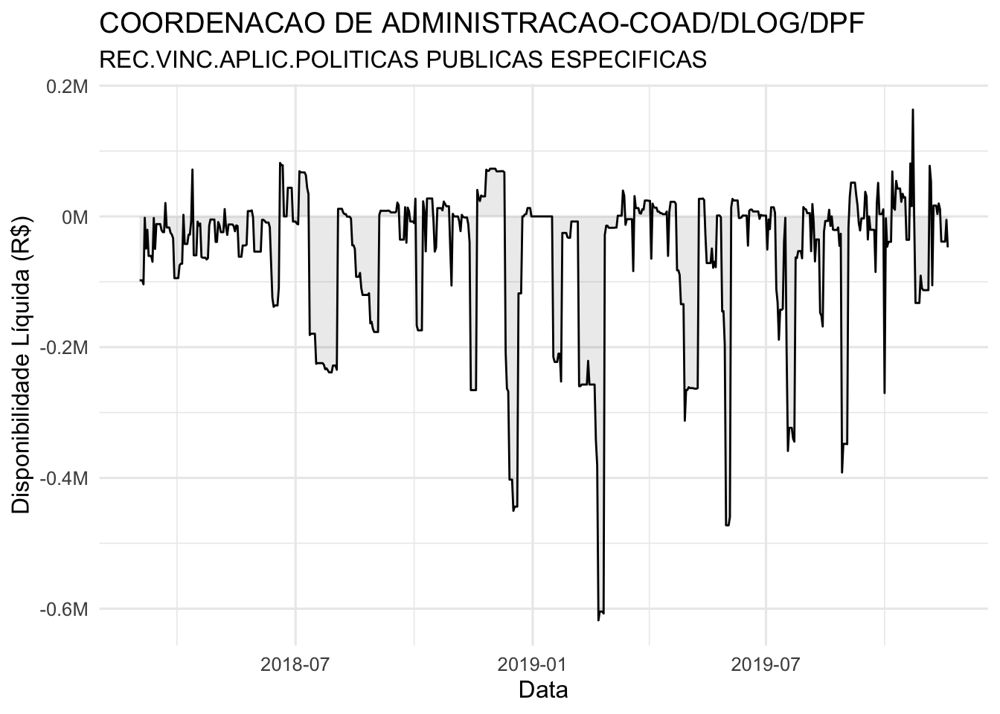
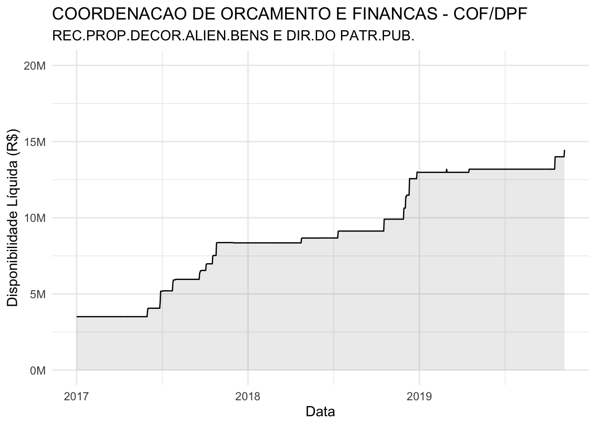
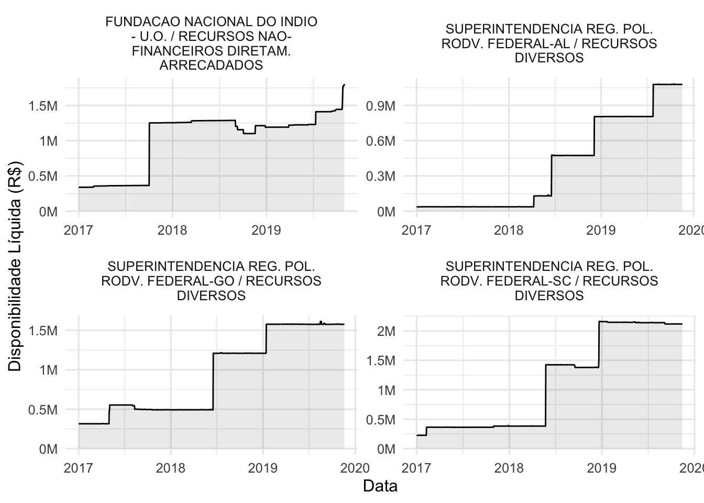
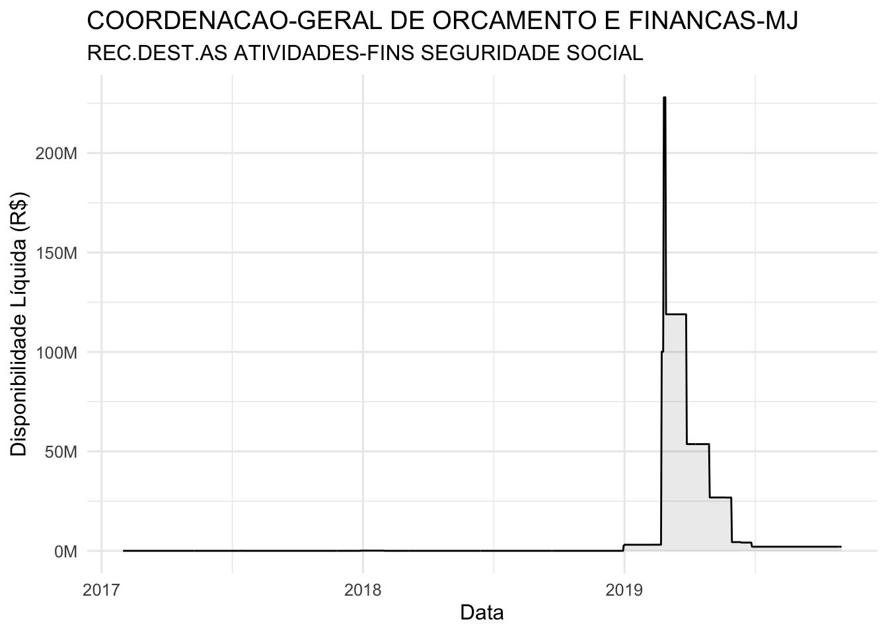
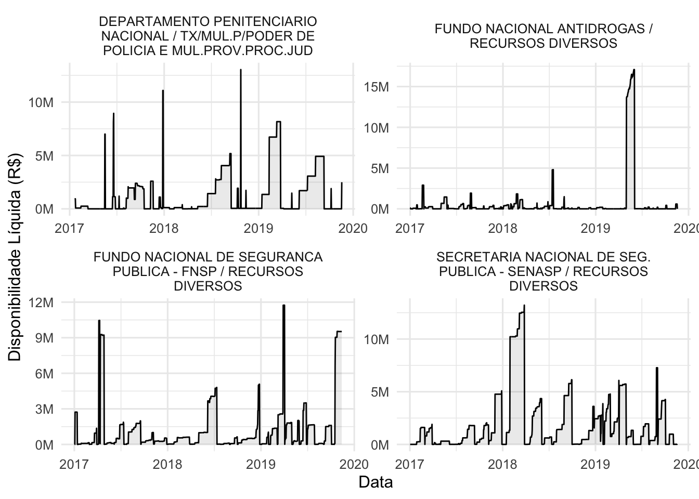
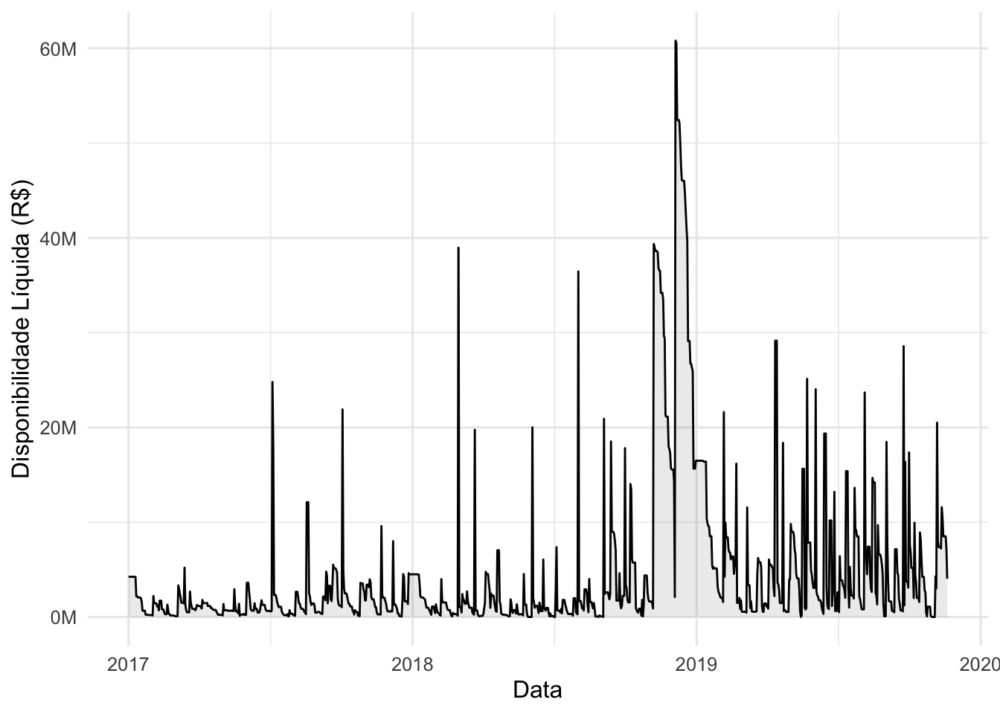

# Empoçamento

## O que é empoçamento?

Uma UG que gere seus recursos de forma saudável tende a manter a sua disponibilidade líquida próxima de do zero. Como por exemplo a *COORDENACAO DE ADMINISTRACAO-COAD/DLOG/DPF* com relação à fonte de recursos *REC.VINC.APLIC.POLITICAS PUBLICAS ESPECIFICA* conforme observamos no gráfico abaixo:

Não acumular verbas dentro da disponibilidade de uma UG é importante para as atividades do Tesouro Nacional. No entanto, por diversos motivos é possível que UG's/Fontes acumulem disponibilidade líquida. Esse acúmulo de disponibilidade líquida é comunmente chamado de empoçamento.

A definição de *empoçamento* é bem abrangente e pode indicar diversas características relacionadas ao manejo de verbas. Neste capítulo descrevemos diversas formas de *empoçamento* encontradas e que devem ser tratadas de formas diferentes.

## Empoçamento total

Este é o exemplo mais simples de empoçamento, no qual uma combinação de UG/FONTE acumula recursos indeterminadamente e com poucos gastos.

Vamos usar como exemplo a UG: *COORDENACAO DE ORCAMENTO E FINANCAS - COF/DPF*
e sua respectiva fonte de recursos *REC.PROP.DECOR.ALIEN.BENS E DIR.DO PATR.PUB.*:

Neste exemplo chamamos de empoçamento total pois uma grande quantidade de dinheiro é acumulada de forma crescente, sem que exista gastos de qualquer forma.

Outros exemplos deste comportamento podem ser observados no gráfico abaixo.

## Empoçamento temporário

O *empoçamento temporário* acontece quando uma UG/FONTE acumula dinheiro após receber uma grande quantia, mas depois de um certo tempo a disponibilidade líquida volta a um patamar normal.

Um exemplo é o que aconteceu com a *COORDENACAO-GERAL DE ORCAMENTO E FINANCAS-MJ* e a fonte de recursos *REC.DEST.AS ATIVIDADES-FINS SEGURIDADE SOCIAL*.

No exemplo, vemos que a UG/FONTE possui o comportamento desejado de disponibilidade líquida durante todo o ano, no entanto, no início de 2019 recebeu uma verba alta e demorou alguns meses para conseguir despender o dinheiro.

Outros exemplos deste comportamento podem ser observados no gráfico abaixo.

Veja que o empoçamento temporário pode acontecer diversas vezes durante o período. O que caracteriza de fato este comportamento é a UG não ter tendência a aumentar a disponibilidade líquida ao longo do tempo como acontece com o que chamamos de *empoçamento total*.

## Empoçamento natural

Chamamos de empoçamento natural aqueles casos em que a UG/FONTE mantém gastos de alto valor constantemente e muitas vezes até atinge disponibilidade negativa. No entanto, como os valores manejados são muito grandes isso pode ter um efeito forte.

Esse tipo de empoçamento não ocorre com muita frequência pois depende de UG/FONTE que fazem movimentações grandes de verba.

Um exemplo pode ser observado na *COORDENACAO DE ORCAMENTO E FINANCAS - COF/DPF* com a fote de recursos *TX/MUL.P/PODER DE POLICIA E MUL.PROV.PROC.JUD*:

Veja que esta UG/FONTE sempre recebe montantes grandes mas também repassa valores grandes, porém como a frequência é muito alta ela acaba acumulando recursos.

Estes casos são mais difíceis de identificar e também se assemelham bastante ao comportamento do *epoçamento temporário*, no sentido de que são *empoçamentos temporários* que acontecem um em sequência do outro.

## Conclusão

Existe um comportamento ideal para a gestão de recursos dentro das UG's no entando este padrão, por diversos motivos pode não ser seguido.

Quando existe de acúmulo de disponibilidade líquida dentro de uma UG/FONTE dizemos que existe *empoçamento*. Existem algumas formas de empoçamento com características diferentes que foram descritas neste capítulo.

No próximo capítulo vamos avaliar indicadores que nos auxiliam à identificar a forma de empoçamento bem como a sua itensidade. Senndo assim, poderemos ordenar as UG's/Fontes de acordo com a sua gestão de verbas, assim auxiliando o Tesouro Nacional a identificar e corrigir entraves nesta gestão.

