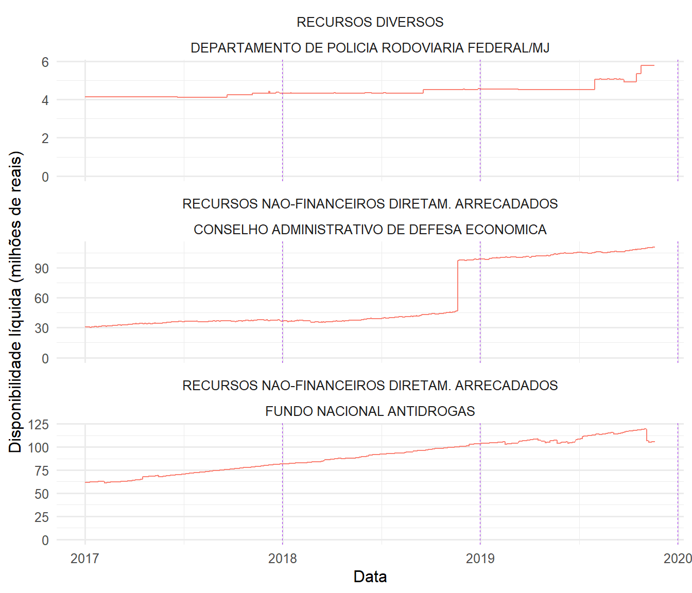
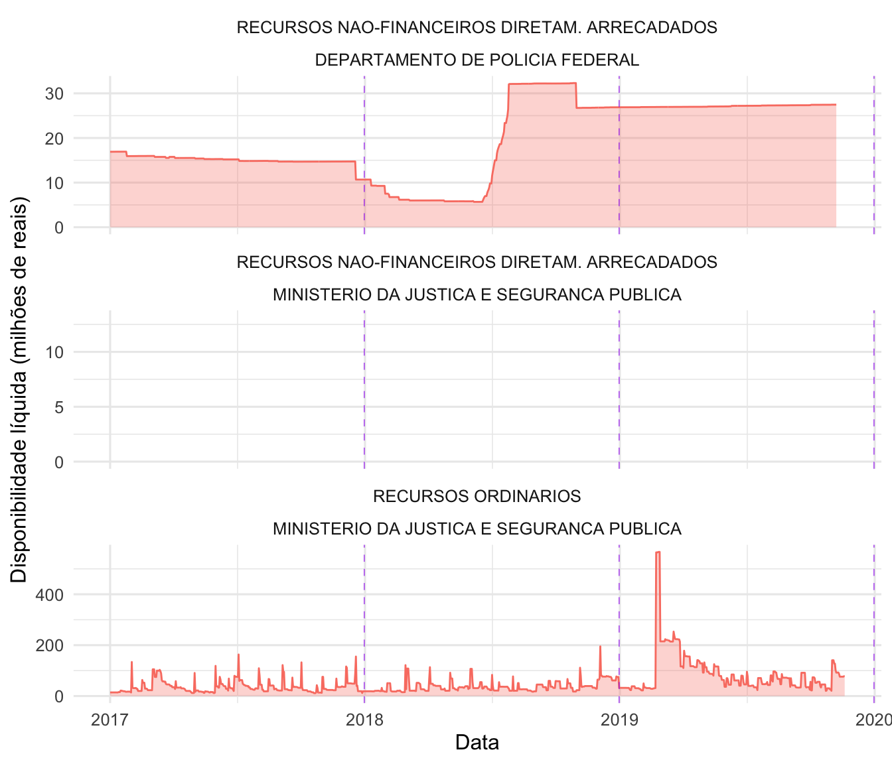

# Quadro analítico histórico 

## Disponibilidades Líquidas

Para responder a questão (a)[a. Qual o comportamento do caixa e das obrigações a pagar (e da disponibilidade líquida) no período analisado?] sobre disponibilidades líquidas das UGs e as respectivas fontes de recursos, elaboramos os seguintes indicadores:

- **Indicador de acumulação de disponibilidade líquida:** acusa potencial problema de UGs que estariam recebendo recursos de fontes que já apresentava valores acumulados.

- **Indicador de persistência de saldo positivo:** acusa potencial problema de recurso estacionado por longo período.

Anexo ao relatório, a tabela **"indicadores.csv"** contém a lista de todas as UGs e fontes de recursos e seus respectivos valores dos indicadores.

### Indicador de acumulação de disponibilidade líquida ($I_{ADL}$)

Indicador que apresenta valor alto quando uma UG apresenta disponibilidade líquida que apenas cresce com o passar do tempo para uma determinada fonte de recurso.

### Definição

Seja $y_i$ a disponibilidade líquida no dia $i$,

$I_{ADL} = P_1 + P_2$

em que 

$$
P_1 = \frac{1}{N}\sum I(y_i > y_{i - 1})
$$

e **para quando a disponibilidade diminui**

$$
P_2 = \frac{1}{N_{y_i < y_{i - 1}}}\sum I(|y_i -y_{i - 1}| < \sigma)
$$

Em outras palavras, o indicador aponta curvas crescentes ($P_1$) permitindo pequenas perturbações ($P_2$).

### Exemplos

Abaixo estão as três curvas com os maiores valores de $I_{ADL}$:

Órgão                                           Fonte de Recursos                               UG                                             IADL
----------------------------------------------  ----------------------------------------------  --------------------------------------------  -----
CONSELHO ADMINISTRATIVO DE DEFESA ECONOMICA     RECURSOS NAO-FINANCEIROS DIRETAM. ARRECADADOS   CONSELHO ADMINISTRATIVO DE DEFESA ECONOMICA    1.26
FUNDO NACIONAL ANTIDROGAS                       RECURSOS NAO-FINANCEIROS DIRETAM. ARRECADADOS   FUNDO NACIONAL ANTIDROGAS                      1.21
DEPARTAMENTO DE POLICIA RODOVIARIA FEDERAL/MJ   RECURSOS DIVERSOS                               SUPERINTENDENCIA REG. POL. RODV. FEDERAL-BA    1.15

## Indicador de persistência de saldo positivo ($I_{PSP}$)

Indicador com valores altos para as curvas que apresentarem saldos positivos por longa duração de tempo no acumulado do período analisado.

### Definição

Área sob a curva de disponibilidade líquida ponderada pela soma de todas as obrigações pagas. 

Seja $y_i$ a disponibilidade líquida no dia $i$ e $o_i$ as obrigações pagas no dia $i$,

$$
I_{PSP} = \frac{\sum y_i}{\sum o_i}
$$

### Exemplos

Abaixo estão as três curvas com os maiores valores de $I_{PSP}$:

Órgão                                       Fonte de Recursos                               UG                                               IPSP
------------------------------------------  ----------------------------------------------  ----------------------------------------------  -----
MINISTERIO DA JUSTICA E SEGURANCA PUBLICA   RECURSOS ORDINARIOS                             COORDENACAO-GERAL DE ORCAMENTO E FINANCAS-MJ     0.48
DEPARTAMENTO DE POLICIA FEDERAL             RECURSOS NAO-FINANCEIROS DIRETAM. ARRECADADOS   COORDENACAO DE ORCAMENTO E FINANCAS - COF/DPF    0.93
MINISTERIO DA JUSTICA E SEGURANCA PUBLICA   CONTRIB.PATRONAL P/PLANO DE SEGURID.SOC.SERV.   COORDENACAO-GERAL DE ORCAMENTO E FINANCAS-MJ     0.91

