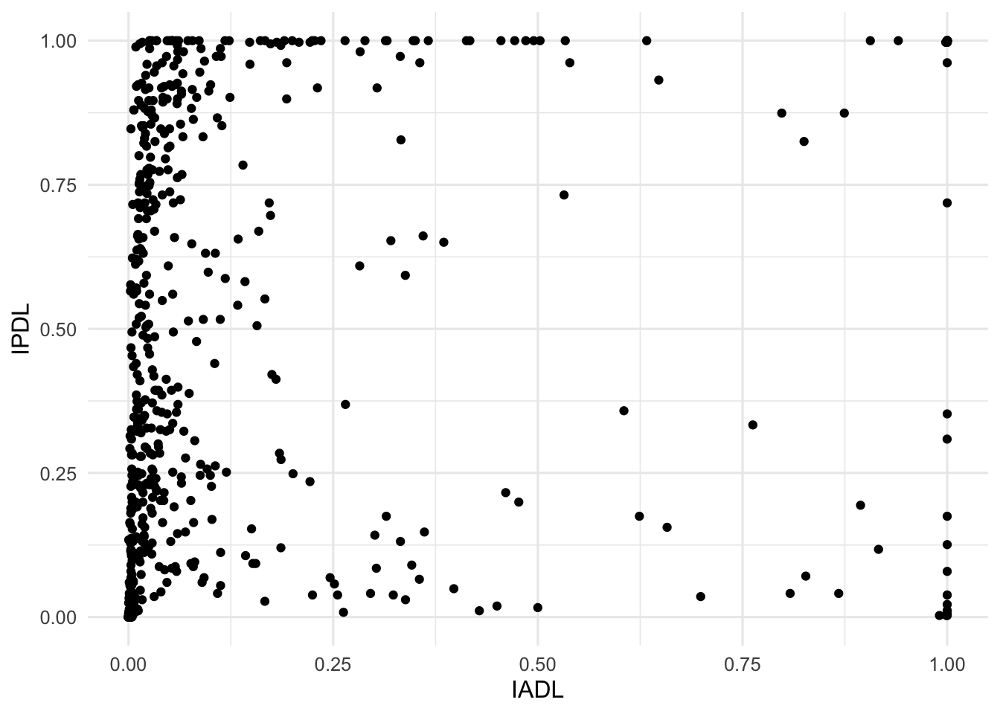
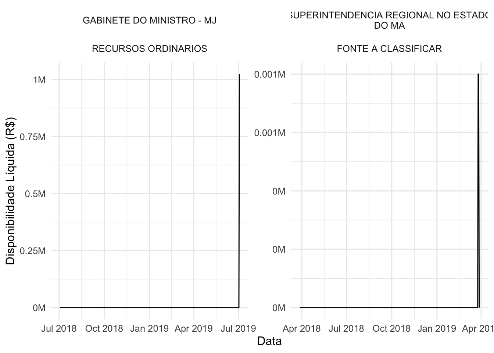
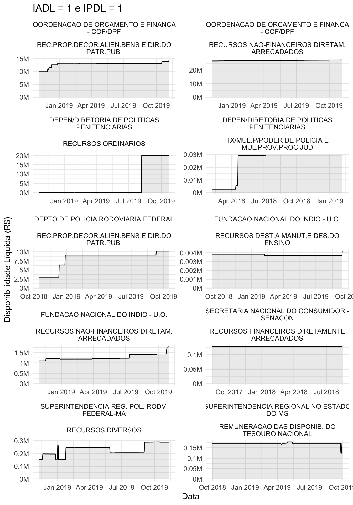
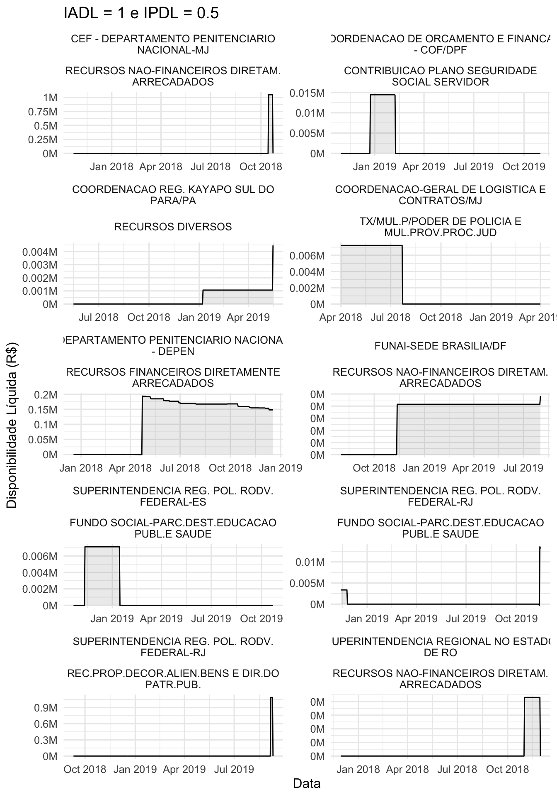
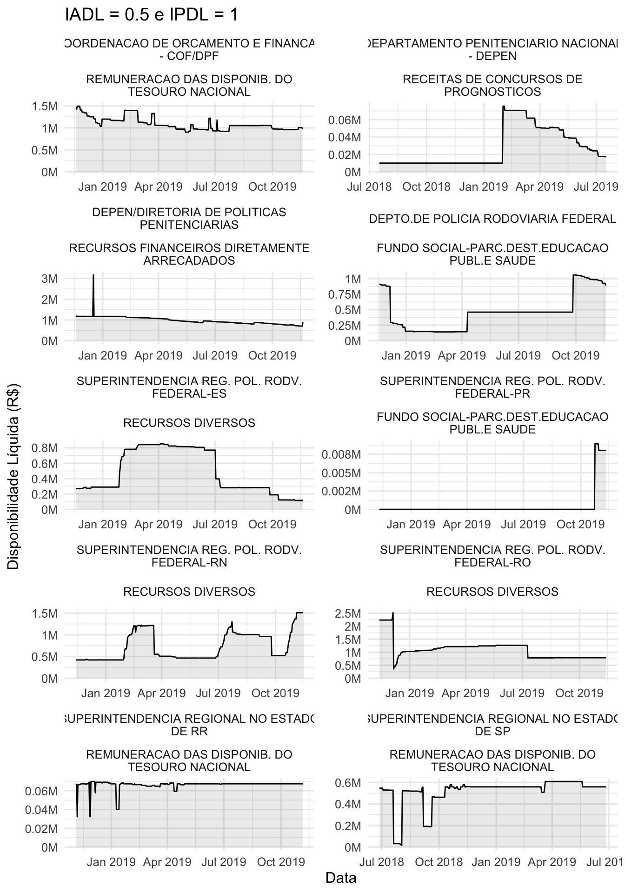
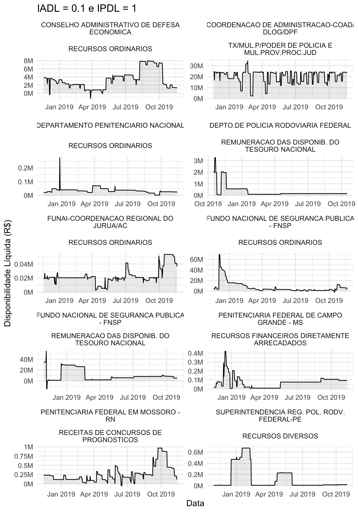
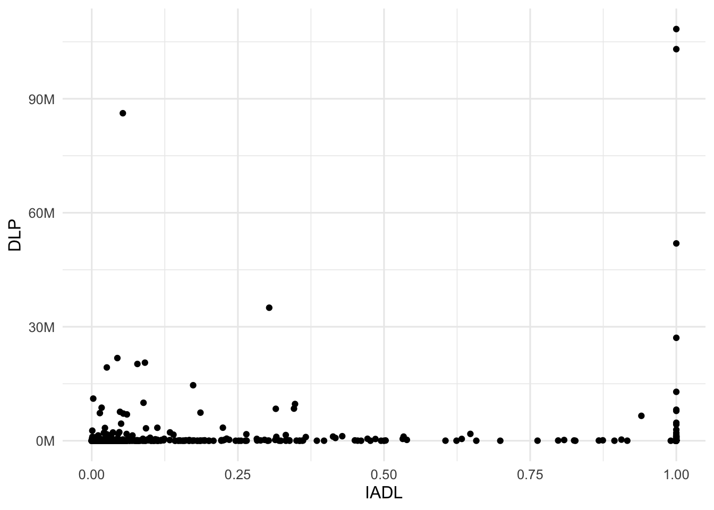
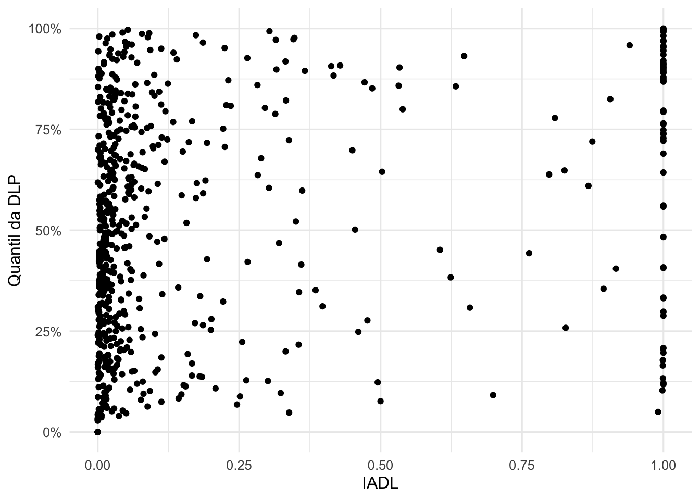
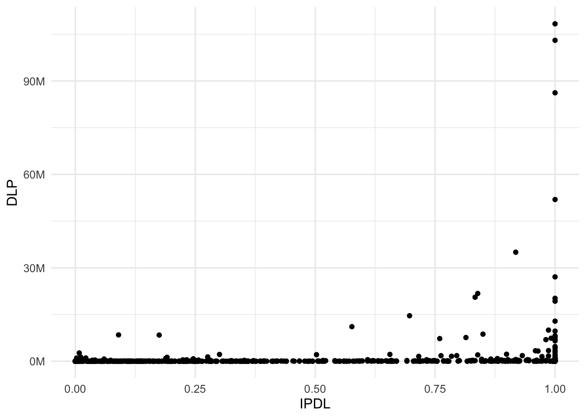
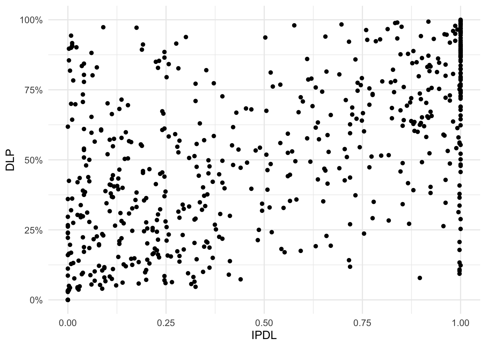

# Índices de empoçamento

No capítulo anterior identificamos o que é empoçamento e quais são os seus principais tipos. Neste capítulo vamos apresentar e avaliar indicadores que permitem:

1. **Quantificar** o empoçamento
1. **Classificar** quanto ao tipo de empoçamento

Os índices desenvolvidos pretendem capturar as principais características da série de disponibilidade líquida que caracterizam algum tipo de empoçamento.

Os índices foram calculados por janelas de 1 ano, isto é, para cada data disponível no banco de dados foram considerados dados dos 365 dias anteriores para o cálculo do índice. Calcular os índices desta forma permite:

1. **Comparar** o índice de UG/Fontes que não possuem o mesmo histórico
1. **Avalliar** a evolução dos indicadores com o tempo

Para os casos em que queremos avaliar as UG's/FONTE sem observar o efeito do tempo consideramos a média do índice em todos os instantes do tempo em que foi calculado.

Também é importante notar que algumas UG/FONTE possuem histórico pequeno para ser analisado de formar estatística, e por isso, foram excluidas das análises a seguir. Para decidir quais seriam analisadas fizemos gráfico a seguir que mostra a quantidade de UG's para cada quantidade de dias com hisórico.

Como boa parte das UG/Fonte possuem todo o histórico, optamos por pegar apenas aquelas que possuem pelo menos 1 ano de histórico, de forma a obter estimativas mais robustas. Com a exclusão de algumas combinações passamos de 856 para 601 combinações de UG e Fonte de recurso.

## Índice acumulação de disponibilidade líquida

Esse índice representa o quanto o valor de disponibilidade líquida positiva foi maior em média do que total de débitos em 1 ano. Em outras palavras, podemos dizer que quando este índice é próximo de 0 significa que sua disponibilidade líquida média sempre foi muito menor do que os seus pagamentos. Quando ele é próximo de 1, indica que a disponibilidade líquida média foi sempre parecida com todos os gastos de 1 ano.

### Cálculo

O cálculo do índice é descrito da seguinte maneira:

$$IADL_i = \frac{\hat{dl_i}}{\hat{d_i}}$$
Em que $dl_i$ é a disponibilidade líquida no dia $i$ e $d_i$ é o débito no dia $i$ 

$$\hat{dl_i} = \frac{1}{365}\sum_{i=1}^{365}dl_{-i}$$

$$\hat{d_i} = \sum_{i=1}^{365} d_{-i}$$

### Distribuição

Uma vez que o índice é calculado em janelas de 1 ano, quando mostrarmos a distribuição por UG, iremos avaliar apenas o valor do índice no último dia em que foi possível calculá-lo para aquela combinação UG/Fonte. Isso pode não ser exatamente o último dia de histórico da base de dados pois uma combinação UG/Fonte pode parar de existir ao longo do tempo.

Note que estamos avaliando a combinação UG/FONTE o que totaliza 601 no banco de dados analisado.

#### IADL maior do que 1

Em primeiro lugar avaliamos aquelas combinações UG e Fonte que possuem  IADL mairo do que 1. O índice ser maior do que 1 significa que a disponibilidade líquida média diária foi maior do que tudo que foi gasto durante o ano inteiro. Em geral, quando o IADL é maior do que 1, é por que nenhuma despesa aconteceu durante ano e aquela combinação possuia disponibilidade líquida positiva.

iadl > 1      n
---------  ----
não         566
sim          35

No gráfico abaixo é possível visualizar as 10 combinações com maiores valores do IADL.

Veja que esses casos são os mais clássicos de empoçamento pois existe disponibilidade líquida positiva e nenhum gasto. Esses são casos anteriormente chamamos de *empoçamento total*.

Esses podem não ser os casos interessantes de empoçamento mas, nas próximas análises vamos combinar este índice com a disponibilidade líquida média diária para poder encontrar empoçamentos com valores mais altos.

#### Distribuição do IADL

No gráfico abaixo podemos visualizar um historama da distribuição do IADL.
Cada barra mostra a quantidade de combinações UG e Fonte que possuem aquele valor do IADL.
Podemos verificar que a maioria das combinações possui valor do IADL muito ptóximo de 0.

#### IADL próximo de zero

Vamos observar agora alguns exemplos de combinações que possuem IADL bem próximo de zero. 
Lembre-se que próximo de zero significa que não há empoçamento.

Mais uma vez esses podem não ser os casos mais interessantes de empoçamento, pois, são aqueles em que a disponibilidade líquida é negativa durante todo período. No entanto, isso mostra que o indicador consegue capturar quando não existe empoçamento.

#### Mais exemplos

O gráfico a seguir mostra exemplos de combinações UG/Fonte que estão próximas
de cada quantil da distribuição do IADL. Podemos verificar por esse gráfico que o IADL parece ser uma medida razoável para quantificar o empoçamento.

Com as análises anteriores mostramos que o IADL parece ser uma medida razoável para quantificar o empoçamento. A seguir vamos apresentar um indicador que será útil para a classificação do tipo de empoçamento.

#### Classificação

De acordo com as análises anteriores sugerimos a seguinte classificação para uma combinação UG/Fonte com base em seu valor do IADL.

1. SEM EMPOÇAMENTO: IADL < 0.02
2. EMPOÇAMENTO MODERADO: IADL entre 0.02 e 0.8
3. EMPOÇAMENTO ALTO: IADL > 0.8

A tabela a seguir apresenta a quantidade de combinações UG/Fonte em cada uma das categorias.

Categoria IADL               #
------------------------  ----
1. Sem empoçamento         226
2. Empoçamento moderado    313
3. Empoçamento alto         62

## Indicador de persistência de saldo positivo

Este indicadore representa a proporção de dias no ano que uma combinação UG/Fonte teve disponibilidade líquida suficientemente
positiva. A definição *suficientemente positiva* foi calculada com base na média diária de débitos. Portanto, se a disponibilidade líquida for maior que a média ddiária de débitos consideramos que a disponibilidade é suficientemente positiva.

### Cálculo

$$IPDL_i = \frac{1}{n}\sum_{i=i}^{365}(dl_{-i} > d_{-i})$$

Em que $dl_i$ é a disponibilaidade líquida no dia $i$ e $d_i$ é o valor debitado no dia $i$.

### Distribuição

Abaixo temoos um histograma da distribuição do IPDL Podemos ver que a distribuição tem concentrações nas extremidades - muitas combinações UG/Fonte possuem IPDL igual a zero e muitas igual a um. 

#### IDLP igual a zero

Em seguida vamos avaliar alguns exemplos de combinações UG/Fonte que possuem o IPDL igual a zero. Isso vai nos ajudar a verificar se o índice está fazendo sentido para indicar empoçamento.

Quando o IPDL é igual zero, isso significa que a combinação UG/Fonte não teve nehum dia com a disponibilidade suficientemente positiva, portanto essas combinações não devem ter sinais de empoçamento.

De fato é isso que observamos no gráfico acima. 

#### IPDL igual a um

Agora vamos
avaliar combinações que possuem o IPDL igual a um. Essas combinações ficaram o ano inteiro com o IPDL suficientemente positivo, portanto devem ter sinais de empoçamento.

Veja que, no gráfico todas as combinações apresentam sinais de empoçamento total. Isso significa que o índice está conseguindo capturar bem o empoçamento. O IPDL, porém, não indica a intensidade do empoçamento no sentido de valor nominal. 

#### Mais exemplos

No gráfico abaixo visualizamos diversos exemplos de combinações UG/Fonte que possuem IPDL próximos de alguns quantis. Esse gráfico é útil p/ visualizarmos o comportamento das séries dependendo dos valores do IPDL.

Podemos notar que entre os quantis 25% e 75% os comportamentos das séries parecem com o comportamento daquelas com o que chamamos de *empoçamento temporário*. A partir do 75% até o 85% encontramos comportamentos mais parecidos com o que chamamos de empoçamento natural e a partir daí observamos o empoçamento total. Isso mostra que esse indicador captura características importantes para classificar os tipos de empoçamento.

#### Classificação

Com base nas análises anteriores conseguimos criar classificações para as combinações UG/Fonte de acordo com o valor do índice IPDL. As classificações foram:

1. SEM EMPOÇAMENTO: IPDL < 0.02
2. EMPOÇAMENTO TEMPORÁRIO: IPDL entre 0.02 e 0.8
3. EMPOÇAMENTO NATURAL: IPDL entre 0.8 e 0.9
4. EMPOÇAMENTO TOTAL: IPDL > 0.9

A tabela a seguir apresenta a quantidade de combinações UG/Fonte em cada uma das categorias.

Categoria IPDL                 #
--------------------------  ----
1. Sem empoçamento            32
2. Empoçamento temporário    387
3. Empoçamento natural        44
4. Empoçamento total         138

## IADL e IPDL

Nests seção vamos avaliar a relação entre os indicadores criados. ''

Note que não existe uma correlação forte entre os índices, o que é importgante uma vez que um deles pretende quantificar o empoçamento enquanto o outro possui o objetivo de classificá-lo.

#### IADL = 1 e IPDL = 0

Alguns casos chamam atenção pois apresentam IADL muito alto e IPDL baixo.
Podemos visualizar essers casos no gráfico abaixo.

Isso acontece quando o período de acúmulo foi muito pequeno mas com
valores muito exorbitantes para aquela combinação UG/Fonte.

O caso contrário, isto é, o caso em que o IADL = 0 e IPDL = 1 não acontece na base de dados.

#### Mais exemplos

Agora vamos mostrar alguns exemplos de outros casos que podem acontecer na nossa base de dados. Esses exemplos servem para criar uma sensibilidade do que a combinação do IADL com o IPDL podem nos ajudar a identificar.

Veja que quando ambos os índices possuem o valor muito alto encontramos casos de empoçamento total com combinações de UG/Fonte que praticamennte não fizeram nenhum pagamento.

Abaixo, quando o IPDL é 0.5 e o IADL é alto encontramos exemplos de empoçamento temporário com períodos mais longos ou com valores mais altos comparados aos gastos da Ug/Fonte.

Quando o IPDL é baixo e o IADL é alto encontramos os casos típicos de empoçamento temporário.

No gráfico abaixo encontramos casos de empoçamento total com intensidade moderada.

Vemos abaixo exemplos de empoçamento total porém com intensidade ainda menor.

Verificamos com os exemplos que os índices estão aparentemente conseguindo quantificar e classificar as combinações UG/Fonte de acordo com a intensidade e tipo de empoçamento.

## Indicadores e Disponibilidade Líquida positiva

Avaliamos também o comportamento dos indicadores de acordo com a disponibilidade líquida positiva média.

### IADL

Vemos que não existe também uma relação muito forte entre o IADL e a Disponibilidade líquida positiva média. Indicando que podemos usar a combinação dos dois para encontrar casos de empoçamento alto e que envolvem bastante dinheiro.

No gráfico abaixo, ao invés de usarmos o valor absoluto da DLP usamos o percentil de cada observação, isso ajuda a evidenciar que não existe uma relação forte entre as duas medidas.

### IPDL

Também não há uma relação muito forte entre IPDL e DLP. 

## Conclusão

Com as análises apresentadas podemos verificar que o IADL e o IPDL cumprem as suas funções de quantificar a intensidade e classificar o tipo de empoçamento. 

Em conjunto com a disponibilidade positiva média podemos encontrar as combinações de UG/Fonte que apresentam certos tipos e intensidades de empoçamento.

Para auxiliar na exploração dos indicadores foi desenvolvido um app que está acessível pelo [link a seguir](https://rseis.shinyapps.io/explorador_indicador_empocamento/).

