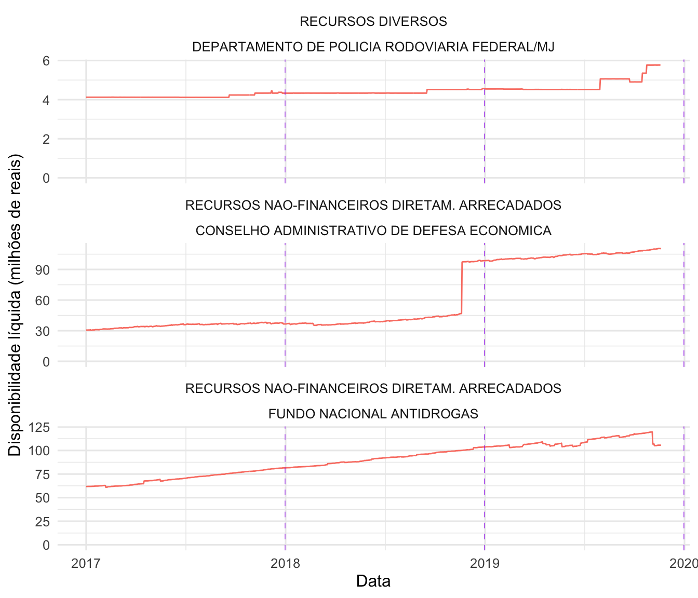
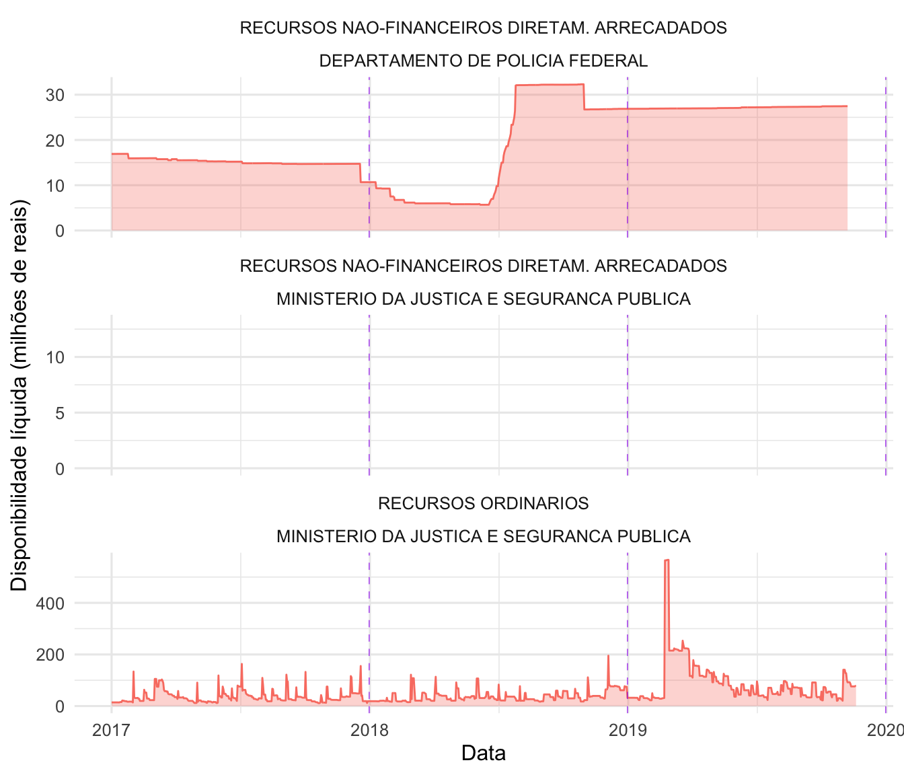

# Disponibilidades Líquidas

Para responder a questão (a)[a. Qual o comportamento do caixa e das obrigações a pagar (e da disponibilidade líquida) no período analisado?] sobre disponibilidades líquidas das UGs e as respectivas fontes de recursos, elaboramos os seguintes indicadores:

- **Indicador de acumulação de disponibilidade líquida:** acusa potencial problema de UGs que estariam recebendo recursos de fontes que já apresentava valores acumulados.

- **Indicador de persistência de saldo positivo:** acusa potencial problema de recurso estacionado por longo período.

Anexo ao relatório, a tabela **"indicadores.csv"** contém a lista de todas as UGs e fontes de recursos e seus respectivos valores dos indicadores.

O cálculo dos indicadores foi realizado utilizando uma janela annual completa, isto é, para cada data da base de dados observamos os 365 dias anteriores de movimentações para calcular o índice. 

Calcular os indicadores desta forma permite a análise da evolução dos mesmos ao longo do tempo.

## Indicador de acumulação de disponibilidade líquida ($I_{ADL}$)

Indicador que apresenta valor alto quando uma UG apresenta disponibilidade líquida que apenas cresce com o passar do tempo para uma determinada fonte de recurso.

### Definição

Seja $y_i$ a disponibilidade líquida no dia $i$,

$I_{ADL} = P_1 + P_2$

em que 

$$
P_1 = \frac{1}{N}\sum I(y_i > y_{i - 1})
$$

e **para quando a disponibilidade diminui**

$$
P_2 = \frac{1}{N_{y_i < y_{i - 1}}}\sum I(|y_i -y_{i - 1}| < \sigma)
$$

Em outras palavras, o indicador aponta curvas crescentes ($P_1$) permitindo pequenas perturbações ($P_2$).

### Exemplos

Abaixo estão as três curvas com os maiores valores de $I_{ADL}$:

Órgão                                           Fonte de Recursos                               UG                                             IADL
----------------------------------------------  ----------------------------------------------  --------------------------------------------  -----
CONSELHO ADMINISTRATIVO DE DEFESA ECONOMICA     RECURSOS NAO-FINANCEIROS DIRETAM. ARRECADADOS   CONSELHO ADMINISTRATIVO DE DEFESA ECONOMICA    1.26
FUNDO NACIONAL ANTIDROGAS                       RECURSOS NAO-FINANCEIROS DIRETAM. ARRECADADOS   FUNDO NACIONAL ANTIDROGAS                      1.21
DEPARTAMENTO DE POLICIA RODOVIARIA FEDERAL/MJ   RECURSOS DIVERSOS                               SUPERINTENDENCIA REG. POL. RODV. FEDERAL-BA    1.15

## Indicador de persistência de saldo positivo ($I_{PSP}$)

Indicador com valores altos para as curvas que apresentarem saldos positivos por longa duração de tempo no acumulado do período analisado.

Este indicador representa quantas vezes a disponibilidade líquida é maior do que todas as obrigações a pagar do ano. 

### Definição

Área sob a curva de disponibilidade líquida ponderada pela soma de todas as obrigações pagas. 

Seja $y_i$ a disponibilidade líquida no dia $i$ e $o_i$ as obrigações pagas no dia $i$,

$$
I_{PSP} = \frac{\sum\frac{y_i}{n}}{\sum o_i}
$$

### Exemplos

Abaixo estão as três curvas com os maiores valores de $I_{PSP}$:

Órgão                                       Fonte de Recursos                               UG                                               IPSP
------------------------------------------  ----------------------------------------------  ----------------------------------------------  -----
MINISTERIO DA JUSTICA E SEGURANCA PUBLICA   RECURSOS ORDINARIOS                             COORDENACAO-GERAL DE ORCAMENTO E FINANCAS-MJ     0.48
DEPARTAMENTO DE POLICIA FEDERAL             RECURSOS NAO-FINANCEIROS DIRETAM. ARRECADADOS   COORDENACAO DE ORCAMENTO E FINANCAS - COF/DPF    0.93
MINISTERIO DA JUSTICA E SEGURANCA PUBLICA   RECURSOS NAO-FINANCEIROS DIRETAM. ARRECADADOS   SECRETARIA NACIONAL DO CONSUMIDOR - SENACON       NaN

## Distribuição dos indicadores

Vamos analisar a distribuição dos indicadores em alguns níveis.

### Ug/Fonte

- gráfico de jitter
- alguma descricao em texto do tipo 30% das UG/Fonte tem valor acima de x que é considerado alto...
- histograma
- alguns exemplos de cada faixa

### UG

- gráfico de jitter
- histograma
- alguns exemplos de cada faixa

### Fonte

- gráfico de jitter
- histograma
- alguns exemplos de cada faixa
- destacar a fonte 'recursos ordinários'

## Indicador de Valor Nominal (R$)

O valor nominal indica o montante que a UG possui disponível em caixa. Quanto maior o excedente de caixa de uma UG, maior a tendência ao empoçamento.

### Definição

O indicador de valor nominal no mês $t$ é definido simplesmente pela disponibilidade líquida no fim do período.

$$IVN_t = DisponibilidadeLíquida_t$$
### Exemplos

### Distribuição

## Indicador de disponibilidade líquida projetada por 12 meses

A disponibilidade líquida mostra o caixa atual de uma UG considerando os pagamentos que foram aprovados até aquele mês (mesmo que ainda não tenham sido realizados). Para ser mais conservador consideramos neste índice os pagamentos que seriam aprovados até os próximos 12 meses - assim sendo, uma UG que ternha valores positivos neste indicador tinha no momento $t$ um excedente de caixa maior do que o que ela precisaria nos próximos 12 meses.

### Definição

O indicador é definido da seguinte maneira:

$$IDL_{12m} = DisponibilidadeBruta_t - \sum_{i=t}^{t+12}Pagamentos_i$$

### Exemplos
### Distribuição

## Indicador de Tempo

Este indicador considera o tempo que uma UG permanece com disponibilidade líquida positiva. Quando uma UG permanece por muito tempo com disponibilidade positiva isso pode indicar que existe *empoçamento*.

### Definição

O indicador é definido por:

$$IT = \sum I(DisponibilidadeLíquida_t > 0)$$

### Exemplos
### Distribuição

## Indicador de Variação da Disponibilidade Líquida

A taxa de variação da Disponibilidade Líquida com relação ao mesmo período do ano anterior tem como objetivo encontrar UG's que tiveram aumento no excedente de caixa, podendo indicar que existe *empoçamento*.

### Definição

O indicador é definido por:

$$IVDL_t = \prod_{i=1}^{12}(1 + T_i)^{1/12}$$

Em que:

$$T_i = \frac{DisponibilidadeLíquida_i}{DisponibilidadeLíquida_{i-12}}$$

### Exemplos

### Distribuição

