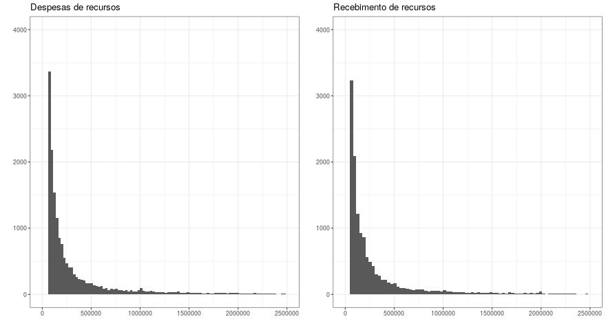
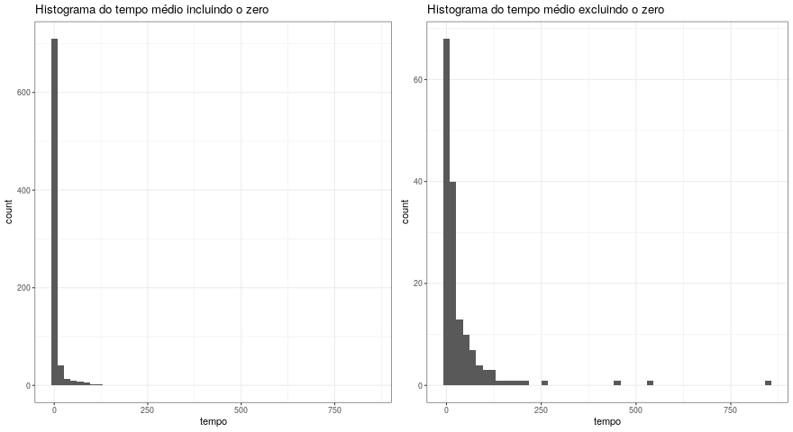
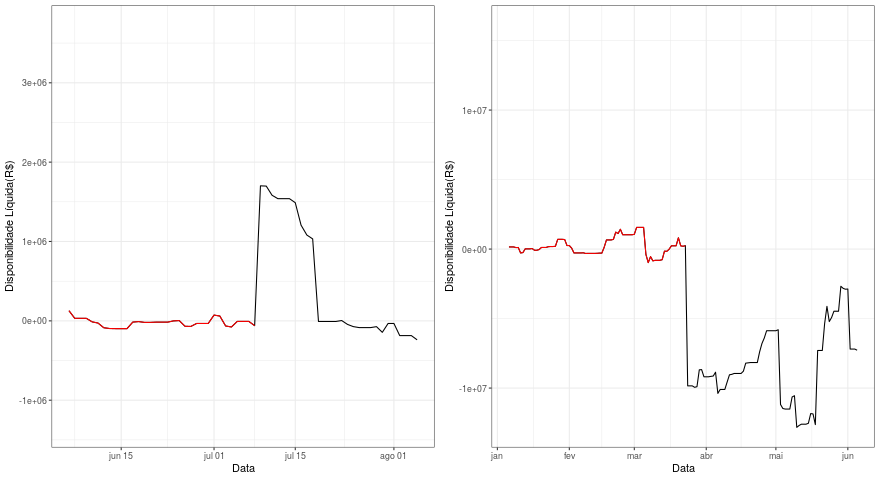
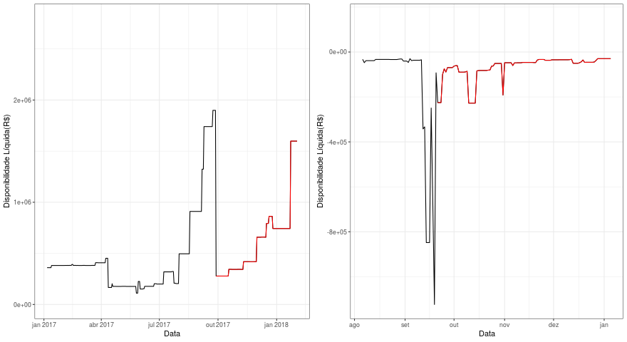
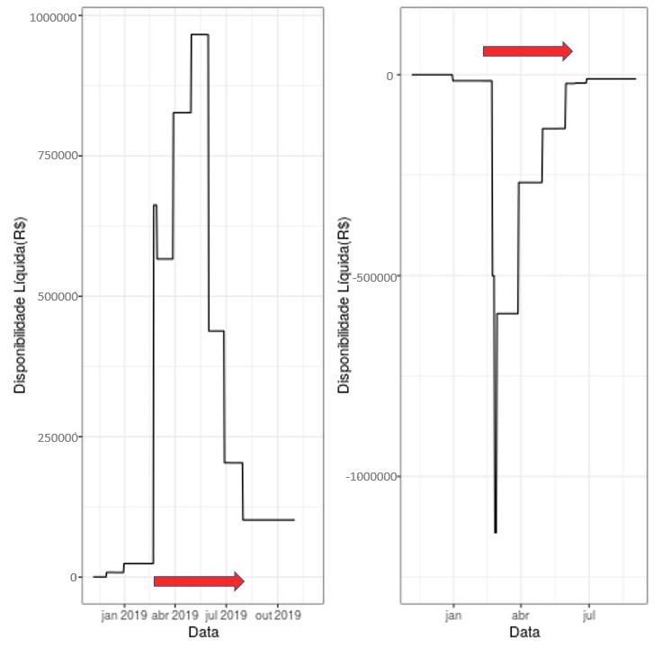
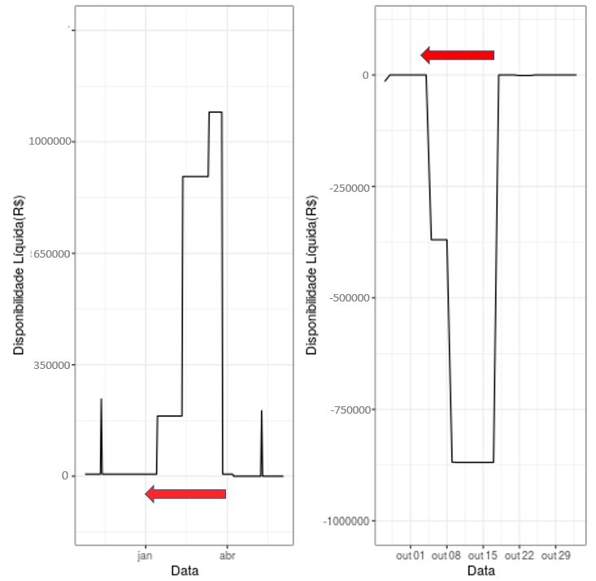
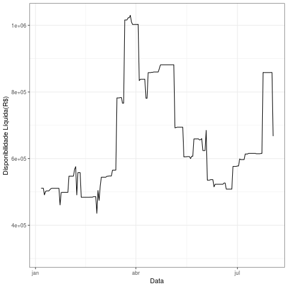

---
output:
  pdf_document: default
  html_document: default
---

# Operações de grande porte

Antes de responder a questao (f) [Qual o intervalo entre duas operações de grande porte], é necessário definir quais operações são consideradas de grande porte. Para isso, a variável `recebimento` foi criada com a informação de `disponibilidade_liquida`. Essa nova variável, basicamente, evidencia se houve uma despesa^[a variável `recebimento ` assume valores menores que zero] ou um recebimento^[a variável `recebimento ` assume valores maiores que zero] de recursos no dia.

Considerando os histogramas abaixo e a tabela de percentis, decidimos determinar de grande porte, operações maiores que um milhão, a fim de abranger menos de 4% de todas as operações.

```{r echo=FALSE}

```


                                           
      Percentil                                 96%         97%          98%           99%   
-------------------------------------------- --------- ------------- ---------- -----------
   recebimentos                              955.946   1.576.742      3.316.659  9.975.018
    despesas                                 777.965   1.184582       2.139.255  5.955.080  


## Intervalo entre operações de grande porte

Depois de definido o que são operações de grande porte, a seguinte questão foi levantada:

- Se a UG/Fonte obteve uma despesa alta em um mesmo dia, mas o recebimento de recursos foi gradativo, ainda deveríamos calcular o intervalo entre estas operações?

Optamos por calcular este intervalo.

Foi encontrado, para cada uma das UG's/Fonte, o tempo médio em que a disponibilidade líquida demora para voltar a sua [Média natural] depois de um recebimento ou de uma despesa alta. O tempo médio das UG's/Fonte que não tiveram recebimentos e despesas de grande porte, foi considerado como zero. 


Assumimos que, no dia seguinte ao último dia de histórico de uma UG/Fonte, a disponibilidade líquida sempre retorna á sua média natural. 

Note que estamos calculando não apenas operações de despesa alta seguida de um recebimento de recursos alto, mas também operações de recebimento de recursos alto seguida de despesa alta.

Nos gráficos abaixo encontram-se a distribuição dos tempos médios das UG's/Fonte.  


```{r echo=FALSE}

```


 
Medidas resumo     Min.           Q1           Q2        Média         Q3         Max.
---------------- -------------- ------------ --------- ------------- ---------- -----------
Tempo               1.0           4.6         12.0         40.1        34.0         850


10 maiores intervalos       1       2        3       4       5        6        7       8         9        10
---------------------- ---------- -------- -------- ------- -------- -------- ------- --------- -------- ---------
                          850       540       444    253     205       189      175      156     139       129


Pelas tabelas e gráficos, observamos que a maior parte dos tempos médios se concentram entre zero e 100 dias. Vemos também que 70% dos intervalos são menores ou iguais a 34 dias. 
É interessante ressaltar que valores muito grandes de tempo médio podem estar associados a UG's/Fonte que apresentam empoçamento total, dado que a sua disponibilidade líquida nunca volta para a média.  


### Média natural

Dividimos as UG's/Fonte em dois casos para determinar as suas respectivas médias naturais: 

a. A primeira grande operação é um recebimento e a sua disponibilidade líquida é maior que zero ou a primeira grande operação é uma despesa e a disponibilidade líquida é menor que zero.

```{r echo=FALSE}
knitr::include_graphics()
```


Neste caso, calculamos a média da disponibilidade líquida dos valores anteriores a esta operação. Observe que, quando há no primeiro dia de histórico uma operação de grande porte, não é possível calcular a média da série, então vamos desconsiderar a UG/Fonte.

b. A primeira grande operação é uma despesa e a sua disponibilidade líquida é maior que  zero ou a primeira grande operação é um recebimento e a disponibilidade líquida é menor que zero.

```{r echo=FALSE}

```


Aqui, calculamos a média da disponibilidade líquida após esta primeira operação de grande porte. 


### Cálculo
Para encontrar o intervalo de tempo das UG's/Fonte, obtemos a primeira operação de grande porte e calculamos o tempo de retorno à média natural, então procuramos a próxima operação de grande porte e também calculamos o tempo de retorno à média. Este processo continua até não existir mais operações de grande porte na UG/Fonte, e então, determinamos a média destes tempos.

Ao calcular o tempo médio, as UG's/Fonte também são dividas em dois casos. Se a operação de grande porte for um recebimento e a sua disponibilidade líquida é maior que zero ou a operação é uma despesa e a disponibilidade líquida é menor que zero, observamos o tempo futuro.



Se a operação de grande porte for uma despesa e a sua disponibilidade líquida é maior que  zero ou a operação é um recebimento e a disponibilidade líquida é menor que zero, observamos o tempo passado, ou seja, contamos em quantos dias no "passado" (da direita para esquerda) a disponibilidade líquida da UG/fonte demorou para voltar a média natural.




### Limitações

O método não oferece bons resultados para todos os casos. Quando a soma dos recebimentos e das despesas se dão de forma gradativa, os valores da variável `recebimento` podem não ser maiores que um milhão, mas a soma deles (disponibilidade líquida) será. O método ignora estas operações no cálculo do tempo médio entre operações de grande porte para todas as UG's/Fonte.

```{r echo=FALSE}

```


    
    
    
    
    
    
  