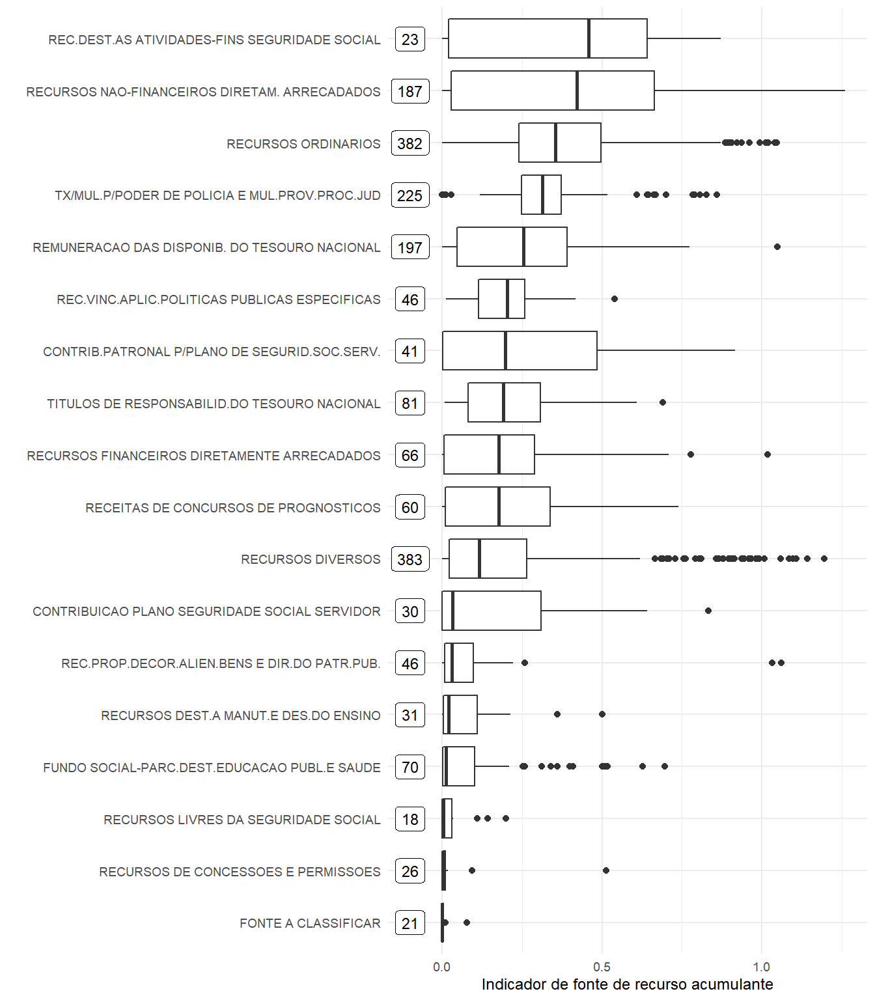

---
output:
  pdf_document: default
  html_document: default
---
# Quadro analítico preditivo 

## Fontes de recursos que tendem a acumular recurso

A tendência é que as fontes de recursos 

- **destinados às atividades com fins de seguridade social**, 
- **não financeiros diretamente arrecadados** e 
- **ordinários** 

tenham perfil recursos de acumulantes enquanto que as fontes de recursos 

- **de consessões e permissões**,
-**livres da seguridade social**,
- **fundo social parcialmente destinados à educação pública e saúde**,
- **destinados a manutenção e desenvolvimento do ensino** e 
- **de alienação de bens e direito do patrimônio público** 

tendem a  não acumularem.

## Previsão de disponibilidade líquida

Construímos modelos de séries temporais para previsão de disponibilidade líquida para cada fonte de recursos e UGs.
O desempenho dos modelos foi avaliado para os períodos de 1 semana, 1 mês, 6 meses e 1 ano.

Foi construída uma calculadora em Shiny para consultar as previsões e resultados de cada um dos cenários.

