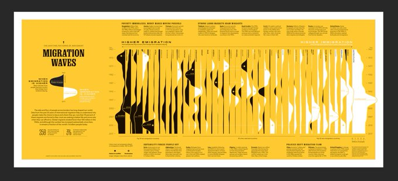

--- 
title: "Documentação do projeto 'Execução Orçamentária e Financeira do Governo Federal' (\"Projeto Caixa\")"
author: "R6 Estatística e Treinamentos LTDA"
date: "2019-12-31"
site: bookdown::bookdown_site
output: 
  bookdown::gitbook:
    lib_dir: "book_assets"
documentclass: book
bibliography: [book.bib, packages.bib]
biblio-style: apalike
link-citations: yes
github-repo: curso-r/stn-caixa
description: "STN-Caixa"
header-includes:
  - \AtBeginDocument{\renewcommand{\chaptername}{Capítulo}}
---


# Introdução

O objetivo deste projeto é analisar o comportamento do caixa e das obrigações financeiras dos órgãos federais, com a finalidade de fornecer informações para a gestão da programação financeira por parte do Tesouro Nacional, além de identificar oportunidades de melhorias nesse processo, e possivelmente fundamentar a criação de indicadores para avaliação da gestão financeira das unidades do Governo Federal.

Elencamos aqui alguns aspectos importantes do projeto.

## Questões investigadas

De início, analisamos o perfil das despesas e receitas das unidades do Governo Federal, começando com os órgãos do Ministério da Justiça (que já possui um sistema de acompanhamento de despesas bem estruturado).

A análise procurou compatibilizar as informações orçamentárias com as informações financeiras. Chamamos de _classificadores orçamentários_: Função, Subfunção, Programa, Ação, Grupo de Despesa, Modalidade de Aplicação, Elemento de Despesa, Indicador de Resultado EOF, Indicador de Exceção Decreto. Como _classificadores financeiros_, nos referimos, essencialmente, à Vinculação de Pagamento.

A _Fonte de Recurso_ é um classificador comum a esses dois contextos, orçamentário e financeiro.

Com esse escopo em mente, em parceria com a equipe do GT-CEAD, as seguintes questões foram abordadas neste projeto:

a. Qual o comportamento do caixa e das obrigações a pagar (e da disponibilidade líquida) no período analisado^[Por órgão, por unidade e por fonte de recursos.]? 

b. Existem casos em que unidades de um mesmo órgão permanecem com disponibilidade líquida negativa, enquanto outras unidades desse mesmo órgão encontram-se com disponibilidade positiva? E se considerar a fonte de recursos, há casos em que o órgão passa por períodos com disponibilidade negativa em uma fonte enquanto há recursos disponíveis em outra fonte? E se considerar as duas situações conjuntamente^[Ou seja, uma unidade de um mesmo órgão fica com disponibilidade negativa em uma fonte, enquanto outra unidade desse mesmo órgão possui disponibilidade positiva nessa mesma fonte.]? 

c. Como as classificações orçamentárias se relacionam com as classificações financeiras? Especificamente, é possível identificar certos tipos de despesas que são sempre (ou frequentemente) pagas com recursos de determinadas vinculações? 

d. Caso seja possível a identificação mencionada em (c), as questões (a) e (b) seriam revisitadas para estimar a disponibilidade líquida para cada vinculação, considerando as classificações orçamentárias das obrigações. Nesse cenário, existem unidades com saldo total suficiente para cobrir todas as suas obrigações, porém com insuficiência em algumas vinculações?

e. Qual o comportamento do caixa das unidades em termos de movimentações?

f. Qual o intervalo entre duas operações^[Uma despesa alta seguida de um recebimento de recursos também alto.] de grande porte?

Para responder essas perguntas, utilizamos ferramentas descritivas e de modelagem preditiva, descritas nos Capítulos 3 e 4, respectivamente. 

## As bases de dados

<!-- Algumas ideias, a serem testadas: -->

<!-- * analisar as despesas pagas, pelos classificadores, pelo número da nota de empenho e pelo número do documento de pagamento; e relacionar documento de pagamento x nota de empenho x vinculação de pagamento pelo campo "inscrição" do documento de pagamento. -->

<!-- * analisar as despesas pagas, pelos classificadores, pelo número da nota de empenho e pelo número do documento de pagamento; e tentar compatibilizar com as informações dos pagamentos efetuados, por vinculação de pagamento e número do documento de pegamento. -->

<!-- * Mais simples: parecido com o anterior, a partir da tabela com as despesas pagas detalhadas pelos classificadores orçamentários, empenho e documento de pagamento, buscar a _vinculação de pagamento_ de uma tabela com toda a movimentação do limite de saque detalhada por documento. Assim, quando a movimentação do limite de saque for um pagamento, o documento correspondente, um documento de pagamento, pode ser usado como chave para relacionar as duas tabelas. -->

Para responder as questões levantadas no item anterior, os dados do SIAFI foram divididos em três bases de dados:

- 1. base de movimentações diárias do limite de saque;
- 2. base de pagamentos diários;
- 3. base de movimentações diárias nas obrigações a pagar.

Com as Tabelas 1 e 3, calculamos a _disponibilidade líquida diária_ a partir da subtração entre os saldos diários do caixa (Tabela 1) e as obrigações a pagar (Tabela 3), para cada unidade gestora ou órgão, e para cada fonte de recursos.

Com as Tabelas 1 e 2, relacionamos no contexto dos pagamentos, as informações orçamentrárias (Tabela 2) com os vínculos de pagamento (Tabela 1).

Finalmente com a Tabela 1, analisamos as movimentações para tipo de documento, obtendo um histórico das movimentações de cada órgão e cada Unidade Gestora.

Na primeira etapa do projeto, essas bases foram estudadas e validadas. Bases auxiliares também foram construídas para facilitar as análises subsequentes. A documentação dessa etapa se encontra no Capítulo 2.

## Análise descritiva

Dada a riqueza de informações e granularidade das bases de dados, todos os resultados descritivos foram construídos em uma aplicação online, que permite a manipulação das visualizações a partir de filtros e seletores.

O aplicativo pode ser acessado a partir do seguinte link: https://rseis.shinyapps.io/explorador_disponibilidades_liquidas_v2/

O código-fonte e manutenção do aplicativo foram repassados à equipe do GT-CEAD ao fim do projeto.

Um resumo dos principais resultados se encontra no Capítulo 3.

## Análise preditiva

Os modelos utilizados neste projeto consideraram os métodos em estado da arte dentro do contexto de modelagem preditiva, como florestas aleatórias, o algorítmo XGBoost e redes neurais.

A descrição dos modelos ajustados e seus resultados se encontram no Capítulo 4.

## Oficina de repasses e implementação dos produtos

A última etapa do projeto consistiu de uma oficina de repasses, realizada presencialmente no GT-CEAD, no Tesouro Nacional, em Brasília. Nessa oficina, foi discutida a teoria por trás dos métodos aplicados, tal como apresentada neste relatório. Também foram apresentados e explicados os scripts em linguagem de programação R utilizados para implementar os modelos.


<!--chapter:end:index.Rmd-->

# Validação e Compreensão dos Dados

## Introdução

A base de dados do SIAFI concentra as informações geradas pelo processo de execução orçamentária e programação financeira do Governo Federal. Este projeto tem como objetivo gerar conhecimento sobre o comportamento do caixa e das obrigações financeiras dos órgãos federais para fins de gestão da programação financeira por parte do Tesouro Nacional, além de identificar oportunidades de melhorias nesse processo e, possivelmente, fundamentar a criação de indicadores para avaliação da gestão financeira das unidades do Governo Federal.

Este é o primeiro dos quatro relatórios que irão compor o projeto e descreve o processo de conhecimento, ajuste e preparo das bases de dados para análises subsequentes.

## Questões elementares

Para nortear as análises das próximas etapas, nessa primeira fase de conhecimento do problema e da base, foram levantadas as seguintes questões:

a. Qual o comportamento do caixa e das obrigações a pagar (e da disponibilidade líquida) no período analisado^[Por órgão, por unidade e por fonte de recursos.]? 

b. Existem casos em que unidades de um mesmo órgão permanecem com disponibilidade líquida negativa, enquanto outras unidades desse mesmo órgão encontram-se com disponibilidade positiva? E se considerar a fonte de recursos, há casos em que o órgão passa por períodos com disponibilidade negativa em uma fonte enquanto há recursos disponíveis em outra fonte? E se considerar as duas situações conjuntamente^[Ou seja, uma unidade de um mesmo órgão fica com disponibilidade negativa em uma fonte, enquanto outra unidade desse mesmo órgão possui disponibilidade positiva nessa mesma fonte.]? 

c. Como as classificações orçamentárias se relacionam com as classificações financeiras? Especificamente, é possível identificar certos tipos de despesas que são sempre (ou frequentemente) pagas com recursos de determinadas vinculações? 

d. Caso seja possível a identificação mencionada em (c), as questões (a) e (b) seriam revisitadas para estimar a disponibilidade líquida para cada vinculação, considerando as classificações orçamentárias das obrigações. Nesse cenário, existem unidades com saldo total suficiente para cobrir todas as suas obrigações, porém com insuficiência em algumas vinculações?

e. Qual o comportamento do caixa das unidades em termos de movimentações?

f. Qual o intervalo entre duas operações^[Uma despesa alta seguida de um recebimento de recursos também alto.] de grande porte?

## Bases de dados levantadas para endereçar as questões

O perfil das despesas do **Ministério da Justiça** será utilizado como ponto de partida das análises descritivas e exploratórias. A escolha deste órgão foi em virtude do seu excelente sistema de acompanhamento das despesas.

Ao todo, três bases foram extraídas:

- `lim_saque` com as movimentações de limites de saque;
- `obrigacoes` com as movimentações de obrigações a pagar; e
- `pagamentos` com as movimentações de pagamentos;

A partir destas, outras três tabelas derivadas foram construídas. As descrições detalhadas estão na seção seguinte.

- `disponibilidades_liquidas_diarias` com as informações diárias de **saldo disponível** e **obrigações a pagar** de cada UG para cada fonte de recursos;

- `vinculacao_de_pagamentos` com informações diárias pareadas de **pagamentos**, **saldo disponível** e **vinculações de pagamentos** de cada documento;

- `lim_saque_por_tipo_de_documento` com as informações diárias de **saldo disponível** por tipo de documento (e.g. NS, OB, PF, etc.).

Verificou-se que as extrações **encontram-se prontas para análise** e com replicações em formatos `.rds` para serem leitas pelo software R. Abaixo estão listados os seus respectivos campos.

## Base 1: Movimentações diárias do Limite de Saque

**Filtro:** item de informação "LIMITES DE SAQUE".

**Campos:**

- Órgão Máximo
- Órgão
- UG
- **Vinculação de Pagamento**
- Fonte de Recursos Detalhada
- Fonte de Recursos
- Documento Lançamento
- Movimento / Valor Financeiro

## Base 2: Pagamentos diários

**Filtro:** item de informação "PAGAMENTOS TOTAIS".

**Campos:**

- Órgão Máximo
- Órgão
- UG
- Fonte de Recursos Detalhada
- Fonte de Recursos
- **Função**
- **Subfunção**
- **Programa**
- **Ação**
- **Grupo de Despesa**
- **Modalidade de Aplicação**
- **Elemento de Despesa**
- **Indicador de Resultado EOF** (indica se a despesa é primária ou financeira, entre outras coisas)
- **Indicador de Exceção Decreto**
- **Ano do Empenho**
- **Empenho**
- **Órgão Máximo da UO** 
- Documento Lançamento
- Movimento / Valor Financeiro

## Base 3: Movimentações diárias em obrigações a pagar 

**Filtro:** item de informação "VALORES LIQUIDADOS A PAGAR (EXERCICIO + RP)".

**Campos:**

- Órgão Máximo
- Órgão
- UG
- Fonte Detalhada
- Fonte (posições 3 e 4 da fonte detalhada -- exemplo: se a fonte detalhada é: `0100123456`, a fonte será `00`)
- **Função**
- **Subfunção**
- **Programa**
- **Ação**
- **Grupo de Despesa**
- **Modalidade de Aplicação**
- **Elemento de Despesa**
- **Indicador de Resultado EOF** (indica se a despesa é primária ou financeira, entre outras coisas)
- **Indicador de Exceção Decreto**
- **Ano do Empenho**
- **Empenho**
- **Órgão Máximo da UO** 
- Movimento / Valor Financeiro

## Tabelas Derivadas

### Disponibilidades líquidas Diárias

- Informações diárias de **saldo disponível** e **obrigações a pagar** de cada UG para cada fonte de recursos. 

- Útil para as questões **a**, **c** e **e**.

- Cruzamento entre as bases `lim_saque` e `obrigacoes` pelas chaves `NO_DIA_COMPLETO`, `NO_FONTE_RECURSO` e `NO_UG`.

- Observações: 352.037

- Campos: 11

```
* NO_DIA_COMPLETO         `<date> 2017-08-22, 2017-08-23, 2017-08-24, 2017-08…`
* NO_UG                   `<chr> "ACADEMIA NACIONAL DA POLICIA RODOV. FEDERAL…`
* NO_ORGAO                `<chr> "DEPARTAMENTO DE POLICIA RODOVIARIA FEDERAL/…`
* NO_FONTE_RECURSO        `<chr> "RECEITAS DE CONCURSOS DE PROGNOSTICOS", "RE…`
* saldo_diario            `<dbl> -2779.98, -5654.96, -7356.26, -5601.60, -560…`
* obrigacoes_a_pagar      `<dbl> 0.000000e+00, 0.000000e+00, 0.000000e+00, 0.…`
* disponibilidade_liquida `<dbl> -2779.98, -5654.96, -7356.26, -5601.60, -560…`
* ano                     `<dbl> 2017, 2017, 2017, 2017, 2017, 2017, 2017, 20…`
* mes                     `<dbl> 8, 8, 8, 8, 8, 8, 8, 8, 8, 8, 9, 9, 9, 9, 9,…`
* dia                     `<int> 22, 23, 24, 25, 26, 27, 28, 29, 30, 31, 1, 2…`
* paded                   `<lgl> TRUE, TRUE, TRUE, TRUE, FALSE, FALSE, TRUE, …`
```

### Vinculação de Pagamentos

- Informações diárias pareadas de **pagamentos**, **saldo disponível** e **vinculações de pagamentos** de cada documento.

- Útil para as questões **b**, **c** e **e**.

- Cruzamento entre as bases `lim_saque` e `pagamentos` pelas chaves `NO_DIA_COMPLETO` e `ID_DOCUMENTO`.

- Observações: 1.005.187

- Campos: 7

```
* NO_DIA_COMPLETO         `<chr> "01/02/2017", "01/02/2017", "01/02/2017", "0…`
* ID_DOCUMENTO            `<chr> "194003192082017OB800016", "194003192082017O…`
* pagamento               `<dbl> 20.79, 724.21, 8000.00, 76.95, -15188.99, -9…`
* NO_VINCULACAO_PAGAMENTO `<chr> "CUSTEIO/INVESTIMENTO - RESUL.PRIM = 2", "CU…`
* vinculacoes_distintas   `<int> 1, 1, 1, 1, 1, 1, 1, 1, 1, 1, 1, 1, 1, 1, 1,…`
* saldo_diario            `<dbl> -20.79, -724.21, -8000.00, -76.95, 15188.99,…`
* pagamento_por_saldo     `<dbl> -1, -1, -1, -1, -1, -1, -1, -1, -1, -1, -1, …`
```

### Limimtes de Saque Por Tipo De Documento

- Informações diárias de **saldo disponível** por tipo de documento. Os tipos de documentos são: `DF`, `DR`, `GF`, `GP`, `GR`, `NL`, `NS`, `OB`, `PF` e `RA`.

- Útil para a questão **d**.

- Derivada da base `lim_saque`.

- Observações: 254.667

- Campos: 7

```
* tipo_de_documento  `<chr> "DF", "DF", "DF", "DF", "DF", "DF", "DF", "DF", "…`
* NO_DIA_COMPLETO    `<chr> "01/02/2017", "01/02/2017", "01/02/2017", "01/02/…`
* NO_UG              `<chr> "COORD. REG. NOROESTE DO MATO GROSSO/MT", "COORDE…`
* NO_ORGAO           `<chr> "FUNDACAO NACIONAL DO INDIO", "DEPARTAMENTO DE PO…`
* NO_ITEM_INFORMACAO `<chr> "LIMITES DE SAQUE (OFSS, DIVIDA, BACEN E PREV)", …`
* NO_FONTE_RECURSO   `<chr> "RECURSOS ORDINARIOS", "RECURSOS ORDINARIOS", "TX…`
* saldo_diario       `<dbl> -35.47, -2089.65, -3644.19, -12.01, -14.94, -31.3…`
```


<!--chapter:end:02-validacao-compreensao.Rmd-->

# Quadro analítico histórico 


## Disponibilidades Líquidas

Para responder as questões (a) e (b) sobre disponibilidades líquidas das UGs, elaboramos:

- Gráficos das séries temporais das disponibilidades líquidas de cada UG e Fonte de Recurso.
- Gráficos das séries temporais das disponibilidades líquidas consolidadas por UG.

Aplicativo: [Explorador das séries temporais das disponibilidades líquidas](https://rseis.shinyapps.io/explorador_disponibilidades_liquidas)

- Indicador de disponibilidade líquida acumulante para as UGs.

### Indicador disponibilidade líquida acumulante por UG

**1) Disponibilidades Líquidas Acumulantes:** Indicador que apresenta valor alto quando uma UG apresenta disponibilidade líquida que apenas cresce com o passar do tempo para uma determinada fonte de recurso.

 

Definição do indicador: $P_1 + P_2$

em que 

$$
P_1 = \frac{1}{N}\sum I(y_i > y_{i - 1})
$$

e **para quando a disponibilidade diminui**

$$
P_2 = \frac{1}{N_{y_i < y_{i - 1}}}\sum I(|y_i -y_{i - 1}| < \sigma)
$$

Em outras palavras, o indicador aponta curvas crescentes ($P_1$) permitindo pequenas perturbações ($P_2$).

Abaixo estão as UGs com os maiores valores do indicador, e suas respectivas fontes de recursos:


\begin{tabular}{l|l|r}
\hline
UG & Fonte de Recursos & Indicador\\
\hline
CONSELHO ADMINISTRATIVO DE DEFESA ECONOMICA & RECURSOS NAO-FINANCEIROS DIRETAM. ARRECADADOS & 1.23\\
\hline
SUPERINTENDENCIA REG. POL. RODV. FEDERAL-BA & RECURSOS DIVERSOS & 1.20\\
\hline
FUNDO NACIONAL ANTIDROGAS & RECURSOS NAO-FINANCEIROS DIRETAM. ARRECADADOS & 1.19\\
\hline
SUPERINTENDENCIA REG. POL. RODV. FEDERAL-GO & RECURSOS DIVERSOS & 1.14\\
\hline
SUPERINTENDENCIA REG. POL. RODV. FEDERAL-SC & RECURSOS DIVERSOS & 1.11\\
\hline
DEPARTAMENTO PENITENCIARIO NACIONAL & RECURSOS NAO-FINANCEIROS DIRETAM. ARRECADADOS & 1.10\\
\hline
SUPERINTENDENCIA REG. POL. RODV. FEDERAL-RO & RECURSOS DIVERSOS & 1.10\\
\hline
SUPERINTENDENCIA REG. POL. RODV. FEDERAL-RO & RECURSOS DIVERSOS & 1.09\\
\hline
SUPERINTENDENCIA REG. POL. RODV. FEDERAL-PR & RECURSOS NAO-FINANCEIROS DIRETAM. ARRECADADOS & 1.07\\
\hline
\end{tabular}


## Classificações Orçamentárias e Financeiras

Destino das fontes de recursos e suas respectivas funções.

<!-- --> 

- Todas as fontes de recursos são repartidas entre **previdência social** e **segurança pública**;
- Porém, se a função for **INSS - EPU CUSTEIO**, o recurso é destinado a Previdência social.

## Comportamento do Caixa por Movimentação

- Gráficos das séries temporais dos saldos e obrigações de cada UG e Fonte de Recurso.
- Gráficos das séries temporais dos saldos e obrigações consolidados por UG.
- Gráfico dos tempos entre duas movimentações de grande porte por UG e por Órgão.

Aplicativo: [Explorador das séries temporais das disponibilidades líquidas](https://rseis.shinyapps.io/explorador_disponibilidades_liquidas)

<!--chapter:end:03-quadro-historico.Rmd-->

---
output:
  pdf_document: default
  html_document: default
---
# Quadro analítico preditivo 


## Fontes de recursos que tendem a acumular recurso

<!-- --> 

A tendência é que as fontes de recursos 

- **destinados às atividades com fins de seguridade social**, 
- **não financeiros diretamente arrecadados** e 
- **ordinários** 

tenham perfil recursos de acumulantes enquanto que as fontes de recursos 

- **de consessões e permissões**,
-**livres da seguridade social**,
- **fundo social parcialmente destinados à educação pública e saúde**,
- **destinados a manutenção e desenvolvimento do ensino** e 
- **de alienação de bens e direito do patrimônio público** 

tendem a  não acumularem.


## Previsão de disponibilidade líquida

Construímos modelos de séries temporais para previsão de disponibilidade líquida para cada fonte de recursos e UGs.
O desempenho dos modelos foi avaliado para os períodos de 1 semana, 1 mês, 6 meses e 1 ano.

Foi construída uma calculadora em Shiny para consultar as previsões e resultados de cada um dos cenários.


<!--chapter:end:04-quadro-preditivo.Rmd-->

# Referências {-}

- NatGep migration waves



https://twitter.com/aLucasLopez/status/1153646875427385344?s=20

- [Diagrama de bolhas em D3 do Jim Vallandingham](https://vallandingham.me/bubble_charts_with_d3v4.html).

- https://www.nature.com/articles/s41598-017-13448-3

- https://github.com/gm-spacagna/deep-ttf/

<!--chapter:end:99-references.Rmd-->

